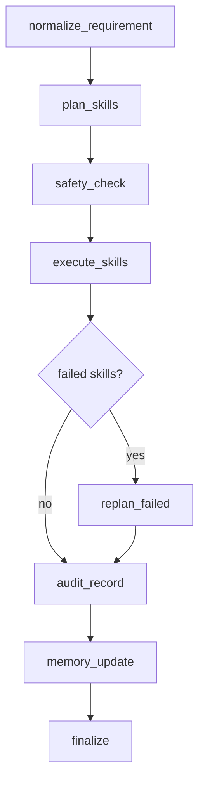

# OpenTHU

OpenTHU 是一个面向校园场景的移动端 Agent 项目，采用“服务端智能规划 + 端侧安全执行”的总体思路，目标是将自然语言目标转化为可控、可审计的系统动作。

## 项目规划

- 阶段一：核心链路打通  
  完成从用户目标输入到任务规划、安全审查、设备执行、结果回传的端到端闭环。
- 阶段二：技能体系扩展  
  围绕课程、作业、通知、日历、闹钟等校园高频需求，沉淀可复用的 Skill 能力。
- 阶段三：可靠性与工程化完善  
  强化鉴权、审计、任务持久化与失败重试机制，提升多设备与长期运行稳定性。

## 技术栈

- Android 客户端：Kotlin、Android SDK（minSdk 26）
- 服务端：Python、FastAPI
- 智能工作流：LangGraph
- 模型接入：OpenAI 兼容接口（可配置模型与 base URL）
- 数据与状态：JSON 文件持久化（任务状态、记忆数据）

## 项目框架

```text
OpenCray/
├── app/                    # Android 端：UI、运行时调度、动作执行、安全审核
├── agent/langgraph/        # Agent-Core：规划、安全、审计、记忆、技能管理
├── docs/                   # 架构、接口与研发文档
├── scripts/                # 本地调试与验证脚本
└── test-apks/              # 测试说明与相关资源
```

### 架构说明

- Agent-Core（PC/Server）：负责目标标准化、技能规划、安全审查、审计记录与记忆更新。
- Android Executor（Device）：负责拉取待执行技能，调用本地系统能力执行，并回传结构化结果。
- 通信方式：以 HTTP API 进行设备注册、任务下发、结果回传，形成任务闭环。

### LangGraph 流程图



LangGraph local run:

```bash
python3 -m venv .venv
source .venv/bin/activate
pip install -r agent/langgraph/requirements.txt

python3 agent/langgraph/openthu_agent.py \
  --input "帮我整理本周作业并加到提醒和日历"
```

Agent-Core server run (PC host):

```bash
python3 -m agent.langgraph.agent_core_server \
  --host 0.0.0.0 \
  --port 18789 \
  --store-file agent/langgraph/agent_core_store.json \
  --memory-file agent/langgraph/memory_store.json
```
