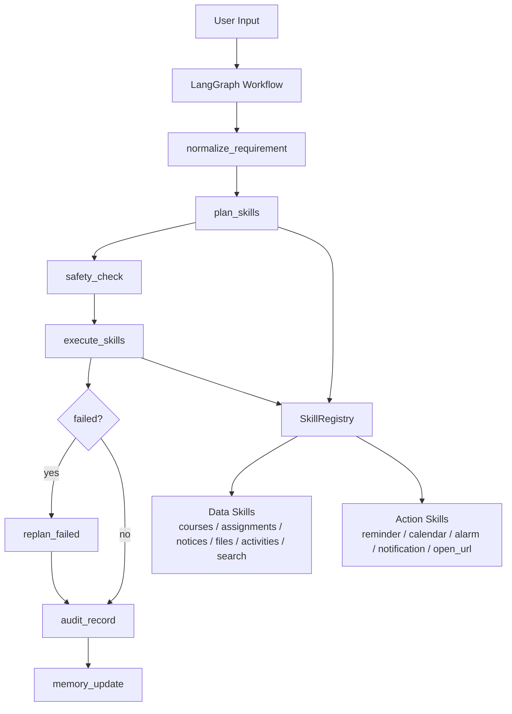

# OpenTHU

OpenTHU is a mobile agent project for Tsinghua student scenarios. It combines:

- an Android prototype app in `app/`
- a LangGraph-based agent core in `agent/langgraph/`
- a skill-first architecture defined in `docs/`

The current direction is no longer "Android app + separate backend planner". We now treat the agent itself as the orchestration core:

- user goals are normalized on-device / in-agent
- the workflow plans a sequence of skill invocations
- data access and local actions are both represented as skills
- safety, approval, execution, audit, and memory stay in the agent runtime

## Current Architecture



## Project Layout

- `/app`
  - existing Android prototype
  - UI, runtime state, safety layer, and local system integration experiments
- `/agent/langgraph`
  - current agent core framework
  - skill registry, workflow orchestration, safety review, audit, memory
- `/docs`
  - `RD.md`: product scope and system boundary
  - `API.md`: skill contracts and workflow state model
  - `API_http.md`: upstream Tsinghua interface references for future skill implementers
- `/scripts`
  - prototype Android testing helpers

## What Changed

The architecture has been shifted to a skill-first model:

1. The old standalone backend planning dependency is removed from the agent core.
2. Reminders, calendar, alarms, assignments, courses, notices, activities, search, and related capabilities are all modeled as skills.
3. The workflow keeps the original core loop:
   - requirement normalization
   - planning
   - safety check
   - approval
   - execution
   - replan
   - audit
   - memory update
4. Concrete skill implementations are intentionally decoupled from the core runtime.

## Current Status

The LangGraph core now provides:

- a docs-aligned `AgentState`
- a `SkillRegistry` boundary for injecting skills
- LLM-first skill planning with deterministic fallback
- hybrid safety review
  - rule-based risk assessment
  - optional LLM risk assessment
  - final risk uses the stricter result
- execution through registered skill handlers
- failure replanning
- audit log generation
- lightweight memory persistence

What is not implemented here:

- most data/auth skill bodies
- upstream Tsinghua HTTP adapters
- in-process Android executors inside Python runtime (action skills are expected to run in Kotlin via bridge)

Those are meant to be added later by separate skill implementers behind the same registry interface.

## LangGraph Core

The current agent entrypoint is:

- [openthu_agent.py](/Users/jasonlau/Documents/homeworks/mobile/openthu/OpenCray/agent/langgraph/openthu_agent.py)

The skill abstraction lives in:

- [skill_core.py](/Users/jasonlau/Documents/homeworks/mobile/openthu/OpenCray/agent/langgraph/skill_core.py)
- [skill_manager.py](/Users/jasonlau/Documents/homeworks/mobile/openthu/OpenCray/agent/langgraph/skill_manager.py)

Skill developer docs:

- [SKILL_MANAGER_SCHEMA_GUIDE.md](/Users/jasonlau/Documents/homeworks/mobile/openthu/OpenCray/agent/langgraph/SKILL_MANAGER_SCHEMA_GUIDE.md)
- [skill_json_schema.template.json](/Users/jasonlau/Documents/homeworks/mobile/openthu/OpenCray/agent/langgraph/skills/skill_json_schema.template.json)
- [skill_test_template.py](/Users/jasonlau/Documents/homeworks/mobile/openthu/OpenCray/agent/langgraph/skills/skill_test_template.py)

## Build

Android build:

```bash
./gradlew -Dhttp.proxyHost= -Dhttp.proxyPort= -Dhttps.proxyHost= -Dhttps.proxyPort= :app:assembleDebug
```

LangGraph local run:

```bash
python3 -m venv .venv
source .venv/bin/activate
pip install -r agent/langgraph/requirements.txt

python3 agent/langgraph/openthu_agent.py \
  --input "帮我整理本周作业并加到提醒和日历"
```
