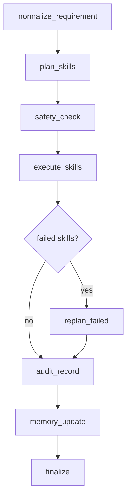

# OpenTHU LangGraph Agent

This module is the current agent core framework for OpenTHU.

It is now designed around a skill-first architecture:

- the workflow does not depend on a standalone backend planner
- both data access and local actions are represented as skills
- the workflow only depends on skill metadata and skill handlers
- concrete skill implementations can be injected later without rewriting the core graph

Deployment modes:

- Local mode: run workflow end-to-end in one Python process
- Server dispatch mode: run planning/safety on PC server, execute data skills on the server, and let Android app pull remaining device actions

## Workflow



## Key Files

- [openthu_agent.py](/Users/jasonlau/Documents/homeworks/mobile/openthu/OpenCray/agent/langgraph/openthu_agent.py)
  - LangGraph workflow
  - state transitions
  - planning / safety / execution / replan / audit / memory
- [skill_core.py](/Users/jasonlau/Documents/homeworks/mobile/openthu/OpenCray/agent/langgraph/skill_core.py)
  - `SkillSpec`
  - `SkillInvocation`
  - `SkillResult`
  - `SkillRegistry`
  - default skill catalog
- [skill_manager.py](/Users/jasonlau/Documents/homeworks/mobile/openthu/OpenCray/agent/langgraph/skill_manager.py)
  - unified execution entry between agent core and skill handlers
  - schema-driven skill argument parsing and runtime validation
  - result normalization and handler exception boundary
  - planner-facing skill list access
- [SKILL_MANAGER_SCHEMA_GUIDE.md](/Users/jasonlau/Documents/homeworks/mobile/openthu/OpenCray/agent/langgraph/SKILL_MANAGER_SCHEMA_GUIDE.md)
  - skill developer guide for `SkillManager` + `args_json_schema`
  - validation behavior, contracts, and best practices
- [agent_core_server.py](/Users/jasonlau/Documents/homeworks/mobile/openthu/OpenCray/agent/langgraph/agent_core_server.py)
  - PC-hosted Agent-Core server
  - plan workflow for device task dispatch with server-side data skill execution
  - HTTPS APIs for device registration, task pull, and result callback

## Core Design

1. `plan_skills`
   - LLM-first skill planning
   - deterministic fallback if no model is available
   - outputs `skill_plan`

2. `safety_check`
   - rule-based risk review
   - optional LLM risk review
   - stricter result wins
   - medium/high risk skills are blocked unless approval is granted for this run

3. `execute_skills`
   - dispatches each approved `SkillInvocation` through `SkillManager`
   - `SkillManager` validates/coerces args using skill schema before calling handler
   - `SkillManager` routes to registered handlers and normalizes result schema
   - the workflow does not know concrete skill internals

4. `replan_failed`
   - creates follow-up `show_summary` skill invocations for failed skills

5. `audit_record`
   - records `plan / safety_check / approve / execute / replan`

6. `memory_update`
   - persists a small execution memory snapshot to JSON

## Skill Templates

- Skill JSON Schema template:
  - [skill_json_schema.template.json](/Users/jasonlau/Documents/homeworks/mobile/openthu/OpenCray/agent/langgraph/skills/skill_json_schema.template.json)
- Minimal skill test template:
  - [skill_test_template.py](/Users/jasonlau/Documents/homeworks/mobile/openthu/OpenCray/agent/langgraph/skills/skill_test_template.py)

## Running Locally

```bash
python3 -m venv .venv
source .venv/bin/activate
pip install -r agent/langgraph/requirements.txt

python3 agent/langgraph/openthu_agent.py \
  --input "帮我整理本周作业并加到提醒和日历" \
  --user-id "thu_demo"
```

Run as Agent-Core server (PC host):

```bash
python3 -m agent.langgraph.agent_core_server \
  --host 0.0.0.0 \
  --port 18789 \
  --store-file agent/langgraph/agent_core_store.json \
  --memory-file agent/langgraph/memory_store.json
```

Grant approval-required skills for one run:

```bash
python3 agent/langgraph/openthu_agent.py \
  --input "帮我把课程DDL加入提醒和日历" \
  --approve-sensitive
```

Pass a local session placeholder when debugging:

```bash
python3 agent/langgraph/openthu_agent.py \
  --input "帮我读取本学期课程通知" \
  --session-id "sess_demo" \
  --semester-id "2025-2026-2"
```

## Important Boundary

This module is only the orchestration core.

It still does not implement most data/auth skills:

- login adapters
- course / assignment / notice fetchers
- notification concrete handlers

Calendar actions are now wired with concrete handlers:

- `create_calendar_event`
- `detect_calendar_conflicts`
- `delete_calendar_event`

These handlers run through `adb shell content` against the connected Android device calendar provider.

Environment variables:

- `OPENTHU_ADB_BIN` (optional, default `adb`)
- `OPENTHU_ADB_SERIAL` (optional, choose one specific device)
- `OPENTHU_CALENDAR_TIMEZONE` (optional, default `UTC`)

## Calendar Skill Tests

Run logic validation without adb/device:

```bash
python agent/langgraph/run_calendar_skill_tests.py --mode mock
```

Run real-device smoke test (requires adb + connected device):

```bash
python agent/langgraph/run_calendar_skill_tests.py --mode adb --adb-serial <device_serial>
```
