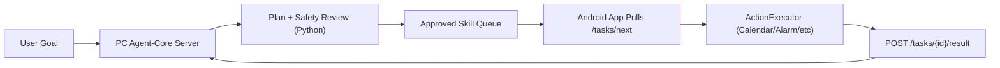

# OpenTHU Agent-Core Server (PC Host)

Version: v0.1-draft  
Date: 2026-04-26  
Status: Draft

## 1. Goal

This document defines the architecture where:

- a personal computer runs Python Agent Core as the planning server
- Android app (physical device or emulator) performs system-level actions locally
- device and server communicate through HTTPS pull APIs
- FCM is used only as wake-up signal (optional in v0.1)

## 2. Architecture



### 2.1 Responsibility Split

- Server:
  - normalize requirement
  - plan skills
  - safety review and approval gating
  - enqueue approved skills for devices
  - aggregate device execution results
- Android app:
  - execute system-affecting skills locally (alarm, calendar, reminder, notification)
  - return structured execution result

## 3. Workflow

1. App registers device metadata.
2. Client posts goal to server planning endpoint.
3. Server runs `plan_only` pipeline:
   - `normalize_requirement`
   - `plan_skills`
   - `safety_check`
   - `audit_record`
   - `memory_update`
4. App calls `/tasks/next` to fetch one approved skill invocation.
5. App executes invocation locally and submits result.
6. Server updates task status (`in_progress` / `completed` / `failed`).

## 4. HTTP API (v0.1)

Base path: `/api/v1`

### 4.1 Register Device

- `POST /devices/register`

Request:

```json
{
  "device_id": "emulator-5554",
  "user_id": "debug_user",
  "platform": "android",
  "fcm_token": "optional",
  "app_version": "0.1.0",
  "capabilities": ["get_current_time", "set_alarm", "create_calendar_event"]
}
```

### 4.2 Plan Task on Server

- `POST /agent/tasks/plan`

Request:

```json
{
  "device_id": "emulator-5554",
  "user_id": "debug_user",
  "goal": "请帮我设置明天早上7点闹钟",
  "approve_sensitive": false,
  "semester_id": "",
  "session": {}
}
```

Response includes:

- `task_id`
- `task_status`
- `approved_skill_count`
- `blocked_skill_count`
- `plan_only_response` (full planning payload)

### 4.3 Pull Next Approved Skill

- `GET /agent/tasks/next?device_id=<device_id>`

Success response:

```json
{
  "code": "OK",
  "data": {
    "task_id": "task_xxx",
    "request_id": "req_xxx",
    "device_id": "emulator-5554",
    "dispatched_at": "2026-04-26T12:00:00Z",
    "skill_invocation": {
      "skill_name": "set_alarm",
      "args": {
        "time": "07:00",
        "label": "作业提醒"
      }
    }
  }
}
```

No task response:

```json
{
  "code": "NO_TASK",
  "message": "No pending approved skills for this device"
}
```

### 4.4 Submit Device Execution Result

- `POST /agent/tasks/{task_id}/result`

Request:

```json
{
  "device_id": "emulator-5554",
  "request_id": "req_xxx",
  "skill_name": "set_alarm",
  "code": "OK",
  "message": "Alarm created",
  "data": {
    "alarm_id": "sys_123"
  },
  "source": "android_app",
  "from_cache": false
}
```

### 4.5 Query Task

- `GET /agent/tasks/{task_id}`

Returns full task document including:

- plan-only output
- approved skills
- blocked skills
- device results
- dispatch state (`in_flight_request_ids`, `completed_request_ids`)

## 5. FCM Integration Notes

In v0.1, FCM is not required to run the core flow.  
Recommended production pattern:

1. Server creates a planned task.
2. Server sends lightweight FCM wake-up (`task_hint` only).
3. App receives push and triggers immediate pull from `/tasks/next`.

Task payload itself should still come from HTTPS pull for reliability and security.

## 6. Run on PC

Install dependencies:

```bash
pip install -r agent/langgraph/requirements.txt
```

Run server:

```bash
python -m agent.langgraph.agent_core_server \
  --host 0.0.0.0 \
  --port 18789 \
  --store-file agent/langgraph/agent_core_store.json \
  --memory-file agent/langgraph/memory_store.json
```

Health check:

```bash
curl http://127.0.0.1:18789/healthz
```

## 7. Android App Integration (Current)

Current app runtime now supports this path:

1. `Connect`:
   - app sends `POST /api/v1/devices/register`
2. `Plan Goal`:
   - app sends `POST /api/v1/agent/tasks/plan`
   - app stores planned skills into Action panel
3. `Run Agent`:
   - app polls `GET /api/v1/agent/tasks/next`
   - app executes each dispatched skill locally
   - app reports result with `POST /api/v1/agent/tasks/{task_id}/result`

For Android emulator connecting to server on the same host machine:

- host: `10.0.2.2`
- port: `18789`
- TLS: disabled (HTTP) in local development
